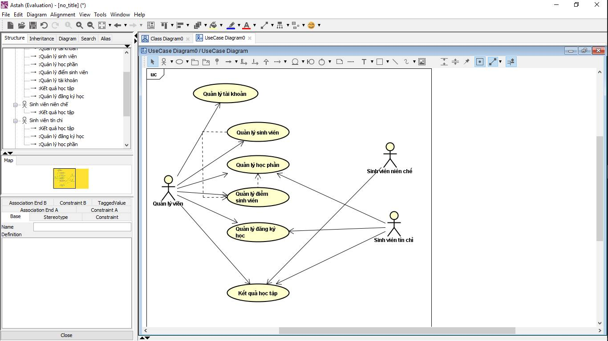
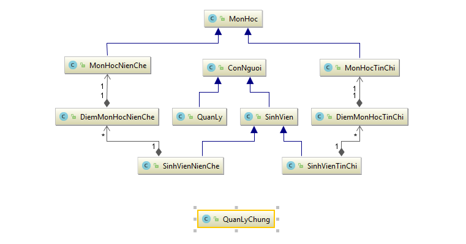
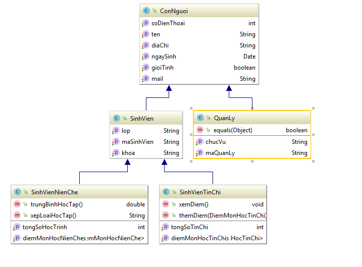
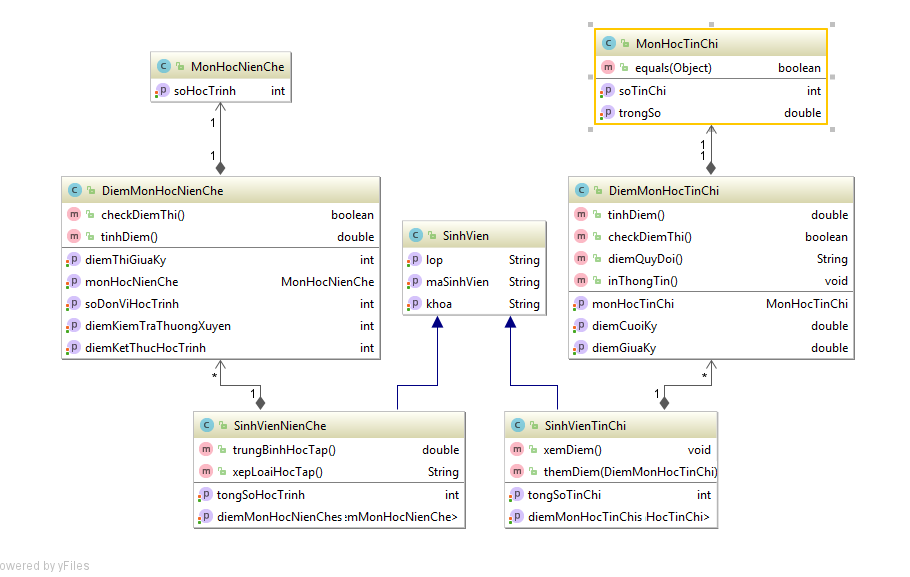
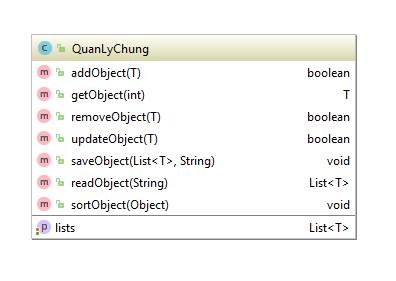
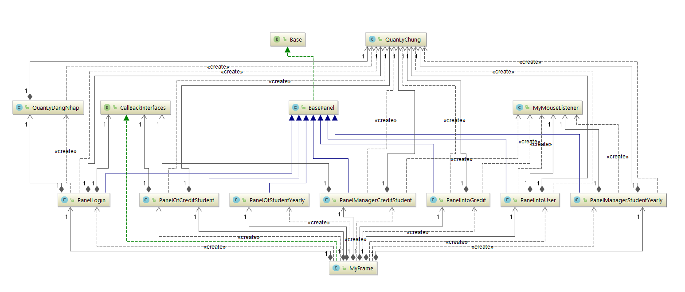
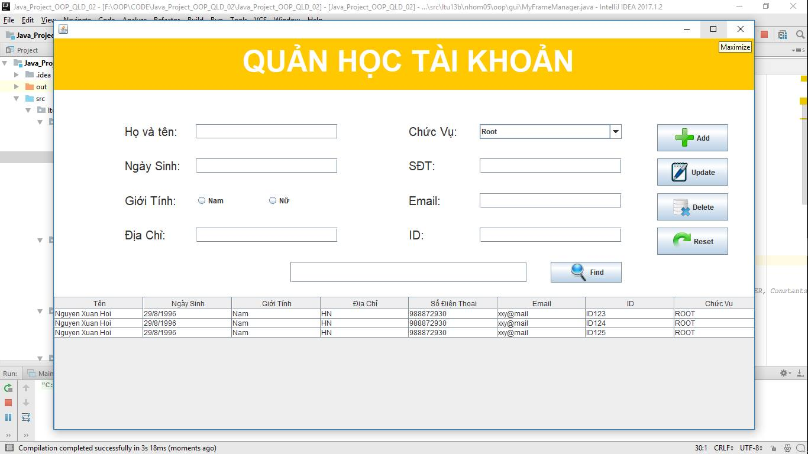
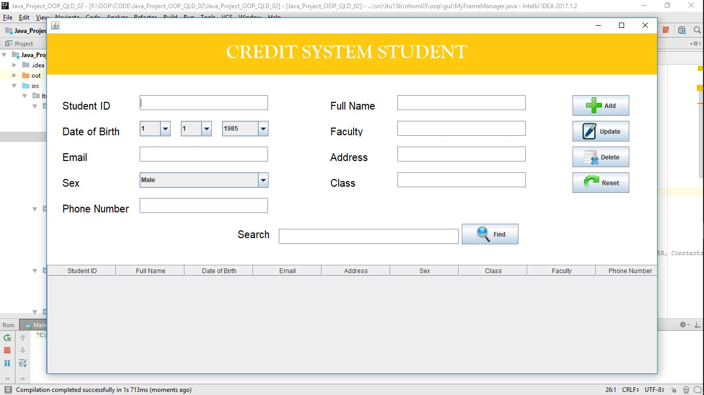
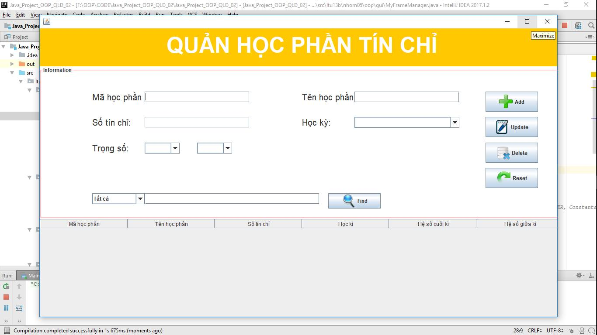
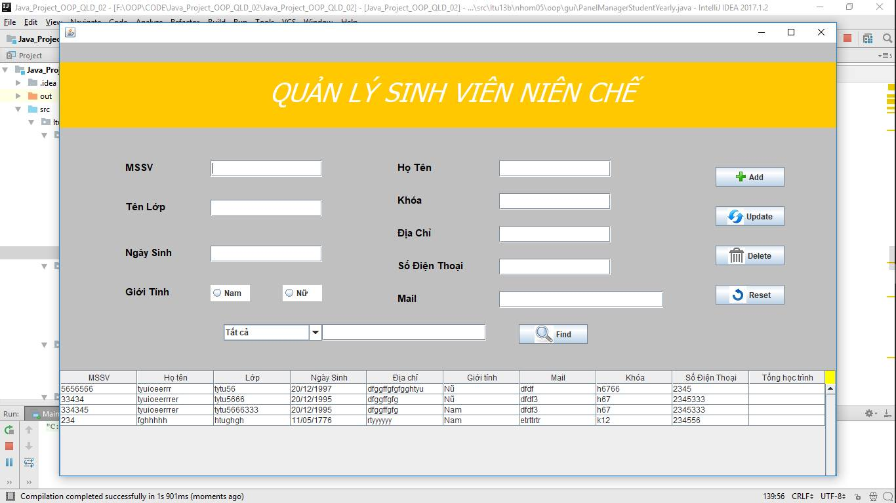

Đăng nhập hệ thống với

a, Người quản lý

\+username ID123\@manager.hust.edu.vn

\+pass :ID123

b.Sinh viên tín chỉ

\+username 20148103\@student.hust.edu.vn

\+pass 20148103

c,Sinh viên niên chế

\+username 20148104\@student.hust.edu.vn

\+pass 20148104

 Thiết kế lớp
-------------

###  3.1.1 Biểu đồ lớp

Chương trình bao gồm một số class chứa các đối tượng:

-   Class SinhVien, QuanLy

-   Class MonHoc, MonHocTinChi, MonHocNienChe

-   Class SinhVienTinChi, SinhVienNienChe

-   Class GiaoDien

-   Class DiemMonHocNienChe, DiemMonHocTinChi

-   Class TaiKhoan

Các thuộc tính, phương thức của mỗi lớp, quan hệ giữa các lớp được thể hiện chi
tiết trong biểu đồ lớp bên dưới

-   Quản lý chung là đối tượng quản lý tất cả gồm : sinh viên tín chỉ và sinh
    viên niên chế… phụ thuộc vào Object truyền vào.

    **3.1.2. Sơ lược chung về giao diện và cách thức hoạt động**

    

-   Tại PanelLogin (giao diện đăng nhập) khi tài khoản là sinh viên tín chỉ thì
    MyFrame(JFrame) sẽ add PanelOfCreaditStudent ( *giao diện dành cho sinh viên
    tín chỉ*).

-   Nếu tài khoản là người quản lý MyFrame(JFrame) sẽ add
    PanelManagerCreditStudent (*giao diện quản lý sinh viên tín chỉ*) ,
    PanelInfoCredit(*giao diện quản lý học phần*), và
    PanelManagerStudentYearly(*giao diện quản lý sinh viên tín chỉ*). Và
    PanelInfoUser(*giao diện quản lý tài khoản admin*).

-   Nếu là sinh viên niên chế MyFrame(JFrame) sẽ add PanelOfStudentYearly (*giao
    diện quản lý sinh viên niên chế*).

 Kết quả chương trình
---------------------

-   *Một số hình ảnh demo thực hiện các chứng năng chính của chương trình. Trên
    mỗi giao diện đều có các phím bấm tương ứng với các chức năng của chương
    trình.*

Một số tình huống kiểm tra không đúng:

\+ Khi người dùng chưa nhập đủ thông tin đã nhấn nút chức năng

\+ Khi người dùng nhập sai mã sinh viên,họ tên,địa chỉ…(nhập vào các kí tự đặc
biêt,nhập vào số…)

\+ Khi người dùng nhập ngày sinh không đúng dạng dd/MM/yyyy…

Áp dụng với các chương trình khác dưới đây.

